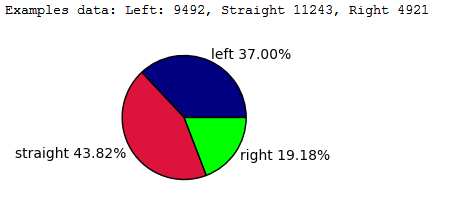
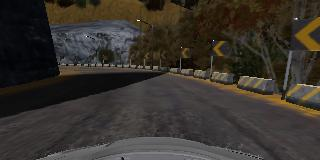
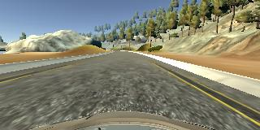
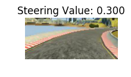
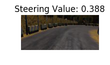
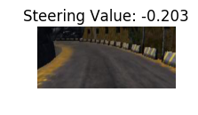

# Car-Behvior-Cloning
<h1>Car</h1>
<h3>Data Collection</h3>

I drove around 25k frames including 1st & 2nd map in the simulator. Most of the frames are from center lane driving and 20% are from side lane recovery. I used PS4 joystick as it is only the appropriate way for proper driving. My target was to train this network only for 1st map as required for this project. I read in a blog post that at least minimum 40k images are required to train a perfect model. I used 25k to save time for training the model, and to avoid memory overflow. And it works.
Following are the details of my dataset.

<ul><li> no. of features: 	25656</li>
<li> Shape of single feature:	(100, 220, 3)</li>
<li> Shape of all features:	(25656, 100, 220, 3)</li>
<li> Shape of labels(steering):	(25656,)</li></ul>

Some images from the dataset: 

 
then I cropped the images and took lower area (road) and resize it to (100,200,3):

